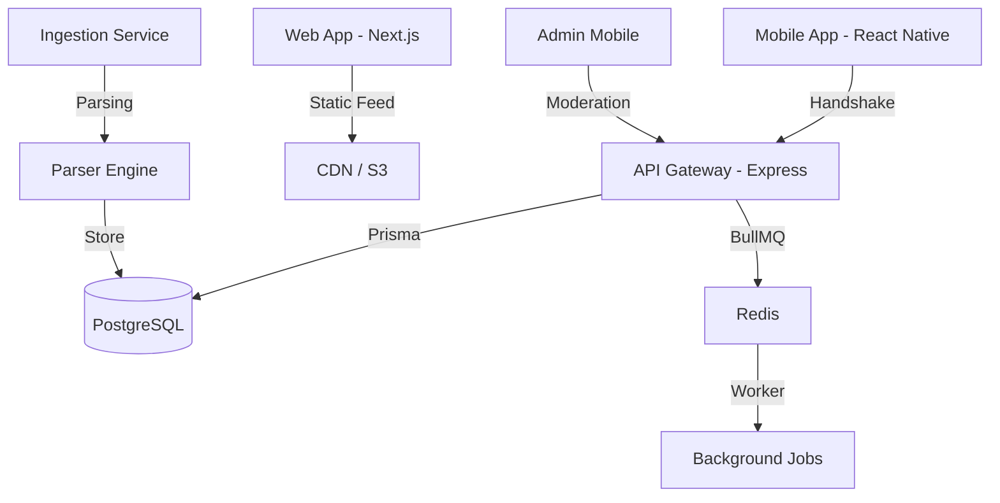

# FresherFlow Monorepo

[](https://fresherflow.in)
[](https://github.com/MukeshCheekatla/fresherflow)
[](https://discord.gg/CcPAnWSHD)
[](https://t.me/fresherflowin)

A verified, high-performance job and walk-in discovery engine tailored for students and graduates across India. Built as a type-safe TypeScript monorepo.

---

## 🏗️ Architecture & Stack

FresherFlow is built with a decoupled frontend, Express backend, and a worker-based parser/ingestion pipeline:



### Core Stack
- **Frontend**: Next.js 16 (Web App), React Native Expo (Mobile App & Admin Mobile)
- **Backend**: Node.js & Express API Gateway, BullMQ background tasks
- **Database**: PostgreSQL with Prisma ORM
- **Cache & Queue**: Redis
- **Monorepo Manager**: Turborepo with `pnpm` workspaces

---

## 📂 Repository Map

The codebase is organized into isolated applications (`apps/`) and shared, type-safe packages (`packages/`):

```
├── apps/
│   ├── web/            # Next.js web portal (port 3000)
│   ├── mobile/         # User mobile application (React Native)
│   ├── admin-mobile/   # Moderation and administrative mobile portal
│   ├── api/            # Central backend REST gateway (port 5000)
│   ├── worker/         # BullMQ queue runner and job processor (port 5001)
│   └── ingestion/      # Data scrapers and raw lead processor
├── packages/
│   ├── database/       # Prisma models, migration scripts, and database client
│   ├── types/          # Shared TypeScript interfaces (Source of Truth)
│   ├── ui/             # Reusable UI component configurations & design tokens
│   ├── domain/         # Core business logic (eligibility matching, profile scores)
│   ├── api-client/     # Axios API wrapper shared across frontend packages
│   └── parser/         # NLP pattern-matching pipeline to parse job listings
```

---

## 🚀 Getting Started & Onboarding

To set up the monorepo locally, configure environment variables, and run development databases, please follow our step-by-step onboarding guide:

👉 **[Setup & Onboarding Guide](./docs/setup.md)**

---

## 🎮 Development Commands

All tasks are managed at the root using `pnpm` and Turborepo:

| Script | Action |
| :--- | :--- |
| `pnpm dev` | Launches all applications concurrently (checks and frees conflicting ports) |
| `pnpm dev:web` | Run only the Next.js web application |
| `pnpm dev:mobile` | Run only the user Expo mobile application |
| `pnpm dev:api` | Run only the REST API express server |
| `pnpm build` | Builds all packages and services for production |
| `pnpm typecheck` | Compiles and validates TypeScript types across the workspaces |
| `pnpm db:generate` | Generates the local Prisma Client |

---

## 🗺️ Product Roadmap

We are actively driving towards our Mobile MVP release. To view our milestones, current checklist, and contributor guidelines, check:

👉 **[Launch Roadmap](./ROADMAP.md)**
