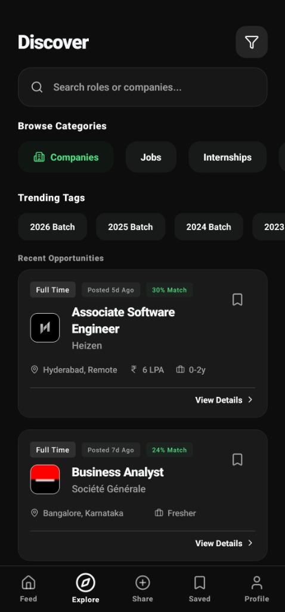
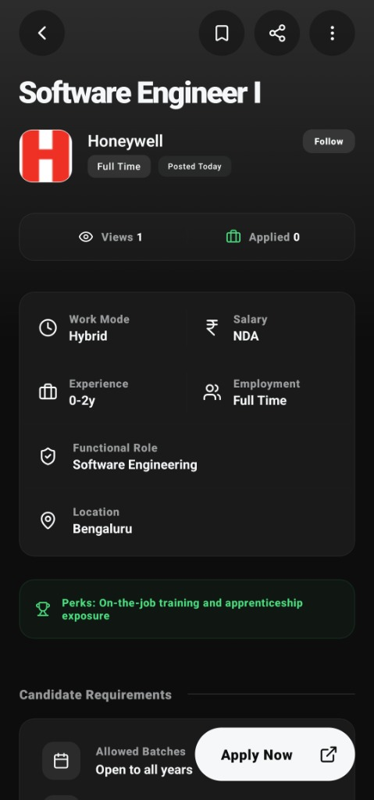
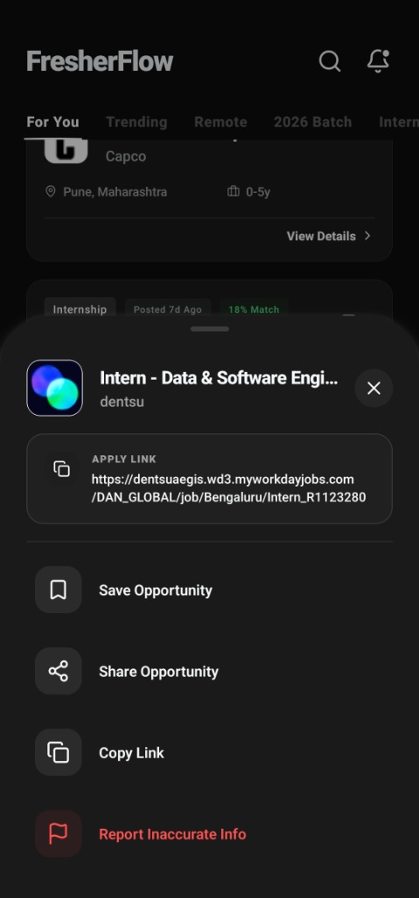
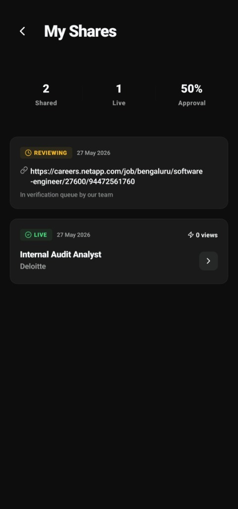

<table>
  <tr>
    <td width="100" valign="center" style="border: none;">
      
    </td>
    <td valign="center" style="border: none; padding-left: 20px;">
      <h1 style="margin: 0; padding: 0; border: none;">FresherFlow</h1>
      <p style="margin: 5px 0; font-size: 1.1em;">A verified, high-performance job and walk-in discovery engine for graduates and students across India. Built as a fully type-safe TypeScript monorepo.</p>
    </td>
  </tr>
</table>

---

<p align="center">
  <a href="https://fresherflow.in">
    
  </a>
  <a href="https://github.com/MukeshCheekatla/FresherFlow">
    
  </a>
  <a href="https://discord.gg/CcPAnWSHD">
    
  </a>
  <a href="https://t.me/fresherflowin">
    
  </a>
  <a href="https://whatsapp.com/channel/0029VbCkZu6FHWq0qJOOU73D">
    
  </a>
  <a href="https://www.linkedin.com/company/fresherflow-in">
    
  </a>
  <a href="https://x.com/Fresherflow">
    
  </a>
  <a href="https://instagram.com/fresherflow">
    
  </a>
  <a href="https://www.facebook.com/FresherFlow.in">
    
  </a>
</p>

---

## 🛠️ Tech Stack

| Layer | Technology |
|---|---|
| Web | Next.js 16 App Router |
| Mobile | React Native + Expo (user app + admin app) |
| Backend | Node.js + Express, TypeScript (strict) |
| Queue / Workers | BullMQ + Redis |
| Database | PostgreSQL via Prisma ORM |
| Cache | Redis |
| CDN / Storage | Cloudflare R2 (bootstrap feed, logos, assets) |
| Monorepo | Turborepo + pnpm workspaces |

---

## 📱 Android App

### Direct APK
👉 **[Download Latest APK](https://github.com/MukeshCheekatla/FresherFlow/releases/latest/download/FresherFlow.apk)**

> Enable **"Install from Unknown Sources"** in Android settings when installing.

### OTA Updates (for developers)
Hot-fix JS changes without a new binary build:
```bash
# Push to staging
eas update --branch staging --message "fix: description"

# Promote to production
eas update:republish --from-branch staging --to-branch production
```

---

## 📂 Monorepo Structure

```
├── apps/
│   ├── web/              # Next.js web portal (port 3000)
│   ├── mobile/           # User mobile app (React Native / Expo)
│   ├── admin-mobile/     # Admin moderation app (React Native / Expo)
│   ├── api/              # Express REST API (port 5000)
│   └── worker/           # BullMQ background processor (port 5001)
├── packages/
│   ├── database/         # Prisma schema + PostgreSQL client
│   ├── types/            # Shared TypeScript types (source of truth)
│   ├── api-client/       # Typed API wrapper used by all frontends
│   ├── domain/           # Core business logic + eligibility matching
│   ├── ui/               # Shared UI components
│   └── parser/           # NLP job description parser
└── scripts/
    ├── job-discovery/    # ATS scrapers + aggregator pipeline
    └── job-processor/    # Job ingestion and submission
```

---

## 🖼️ Screenshots

<table width="100%">
  <tr>
    <td width="50%" align="center">
      <b>Opportunity Discovery</b><br/>
      
    </td>
    <td width="50%" align="center">
      <b>Structured Details</b><br/>
      
    </td>
  </tr>
  <tr>
    <td width="50%" align="center">
      <b>Interactive Actions</b><br/>
      
    </td>
    <td width="50%" align="center">
      <b>Sharing Canvas</b><br/>
      
    </td>
  </tr>
</table>

---

## 🚀 Getting Started

See **[QUICKSTART.md](./QUICKSTART.md)** for the full local setup guide.

**Short version:**

```bash
# 1. Install dependencies
pnpm install

# 2. Start Redis locally
docker compose up -d

# 3. Set up environment variables
cp apps/api/.env.example apps/api/.env
cp apps/web/.env.example apps/web/.env
# Fill in DATABASE_URL (Neon) and REDIS_URL in apps/api/.env

# 4. Run API + Web
pnpm dev:stack
```

### Dev Commands

| Command | What it runs |
|---|---|
| `pnpm dev:api` | API only (port 5000) |
| `pnpm dev:web` | Web only (port 3000) |
| `pnpm dev:stack` | API + Web together |
| `pnpm dev:mobile` | Expo mobile app |
| `pnpm dev:admin-mobile` | Expo admin app |
| `pnpm typecheck` | TypeScript check across all packages |
| `pnpm build` | Production build |
| `pnpm db:generate` | Regenerate Prisma client after schema changes |

---

## 🗺️ Roadmap

👉 **[ROADMAP.md](./ROADMAP.md)**

---

## 🤝 Contributing

See [CONTRIBUTING.md](./CONTRIBUTING.md) to get started.

---

## ⚖️ License

Distributed under the **MIT License**. See [`LICENSE`](./LICENSE) for more details.
